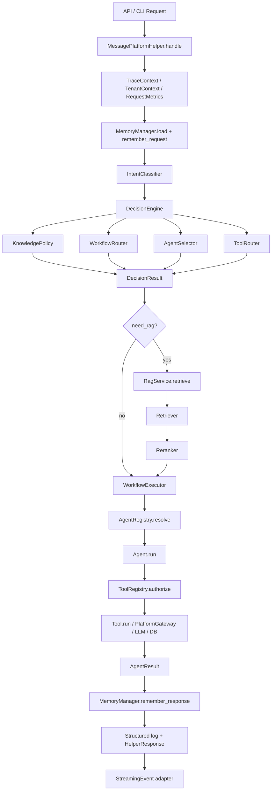
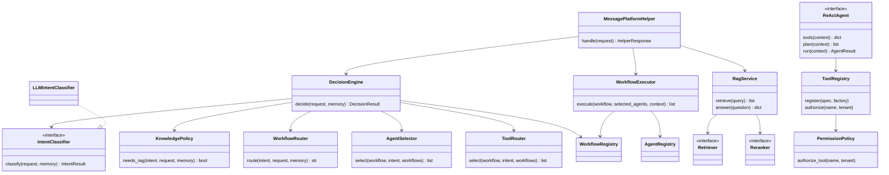

# Message Platform Helper 架构说明

`message-platform-helper` 是企业内部消息平台 AI 助手层。它不替代现有 Java 消息平台和已有 `message-agent`，而是在其上提供可审计、可测试、可扩展的 AI 决策、RAG、Workflow、Agent、Tool 编排能力。

当前架构目标是：先建立未来半年明确会持续扩展的稳定边界，不为了设计模式而设计模式。所有抽象都服务于以下扩展需求：

- 新增 Intent 不修改核心编排代码。
- 新增 Workflow 不修改 Decision Engine。
- 新增 Agent 不修改 Orchestrator。
- 新增 Tool 不写死到 Agent 内部。
- 新增 RAG 后端不影响业务 Agent。
- 企业日志、流式事件、权限、多租户具备统一入口。

## 当前分层

```text
Presentation Layer
  api/                       FastAPI 入口

Application Layer
  application/               Streaming、安全上下文、权限策略

Decision Layer
  decision/                  IntentClassifier、DecisionEngine、Policy、Router、Selector

Workflow Layer
  workflow/                  WorkflowRegistry、WorkflowExecutor

Agent Layer
  agents/                    Agent 实现与 AgentRegistry

Tool Layer
  tools/                     ToolRegistry、工具权限检查

RAG Layer
  rag/                       Retriever、Reranker、PromptBuilder、CitationBuilder、RagService

Infrastructure Layer
  infrastructure/            Trace、Metrics、结构化日志

External Systems
  LLM / PostgreSQL + pgvector / Redis / Java Platform / message-agent / Future MCP
```

## 目录结构

```text
src/message_platform_helper/
  api/
    app.py
  application/
    security.py
    streaming.py
  decision/
    classifier.py
    engine.py
    policies.py
    routers.py
  workflow/
    registry.py
    executor.py
  agents/
    registry.py
    knowledge.py
    template.py
    business_config.py
    channel_config.py
    send_strategy.py
  tools/
    registry.py
  rag/
    knowledge_base.py
    retriever.py
    reranker.py
    prompt_builder.py
    citation_builder.py
    service.py
  infrastructure/
    observability.py
  config.py
  llm.py
  memory.py
  models.py
  orchestrator.py
  platform.py
  server.py

config/
  prompts/
    intent_classifier.txt
  models.yaml
  policies.yaml
  workflows.yaml
  agents.yaml
  tools.yaml

deploy/
  kubernetes/
    message-platform-helper.yaml
```

## 核心调用流程



## 类图



## DecisionResult

Decision Engine 统一返回 `DecisionResult`，再由兼容层转换为旧响应里的 `ReasoningDecision`。

```python
DecisionResult(
    intent="knowledge_query",
    request_type="query",
    domain="business_message",
    operation="explain",
    workflow="knowledge_answer",
    need_rag=True,
    need_tools=True,
    selected_agents=["knowledge"],
    selected_tools=["knowledge.search", "knowledge.answer"],
    confidence=0.91,
    search_query="消息发送失败原因如何排查",
)
```

字段语义：

- `intent`：LLM 或替代 classifier 识别出的业务意图。
- `workflow`：本次请求应进入的工作流。
- `need_rag`：由 `KnowledgePolicy` 决定，不直接听从 LLM。
- `need_tools`：是否存在待调用工具。
- `selected_agents`：本次实际参与的 Agent。
- `selected_tools`：Decision 层建议使用的工具集合。
- `confidence`：分类置信度。
- `search_query`：RAG 检索 query。

## Workflow

Workflow 是多个 Agent 的执行定义，不再假设一个请求只能对应一个 Agent。

当前默认 Workflow：

- `knowledge_answer`：`KnowledgeAgent`
- `template_workflow`：`TemplateAgent`
- `implementation_workflow`：`BusinessMessageConfigAgent -> ChannelConfigAgent -> SendStrategyAgent`
- `message_platform_workflow`：多 Agent 组合工作流
- `general_chat`：不执行企业 Agent

Workflow 来源：

- 默认代码定义：`workflow/registry.py`
- 外部配置：`config/workflows.yaml`

新增 Workflow 时，优先改 `config/workflows.yaml`。如果是新的执行语义，例如并行、条件分支、人工审批，再扩展 `WorkflowExecutor`。

## Agent Registry

`AgentRegistry` 负责 Agent 的注册、能力查询、优先级排序和实例创建。

新增 Agent 的推荐步骤：

1. 实现 `ReActAgent` 子类。
2. 在组合根或插件加载器里注册 `AgentSpec` 和 factory。
3. 在 `config/workflows.yaml` 中引用该 Agent。
4. 让 classifier 或 policy route 到对应 workflow。

核心 Orchestrator 不需要知道新 Agent 类。

## Tool Registry

`ToolRegistry` 是工具能力统一入口。当前 Agent 仍保留局部工具定义，并在运行时注册到 ToolRegistry，作为从旧结构迁移到独立 Tool 层的过渡方案。

Tool Registry 已具备：

- 动态注册。
- 按 name 解析。
- 按 capability 查询。
- enabled 开关。
- 权限检查。

后续新增 MCP、SQL、HTTP、Redis、File、Shell、Function Tool 时，应优先落到 `tools/`，再由 Agent 按 tool name 调用。

## RAG 管线

RAG 已从单一 `KnowledgeBase` 拆为：

```text
KnowledgeBaseRetriever
  -> ScoreReranker
  -> RagPromptBuilder
  -> CitationBuilder
  -> RagService
```

当前 `KnowledgeBase` 是 PostgreSQL + pgvector facade，负责文档入库、chunking、embedding 保存和默认知识入库。检索层通过 keyword、substring fallback 和 vector retriever 混合召回。

## Streaming

统一 Streaming 事件由 `application/streaming.py` 生成：

- `Reasoning`
- `Source`
- `ToolCall`
- `Done`
- `Error`

FastAPI 可选入口提供：

- `POST /api/chat`
- `POST /api/chat/stream`

当前流式接口是事件级流式，不伪造 token 级 streaming。真正 token streaming 应在 LLM provider 支持后接入 `Token` 事件。

## Observability

每次请求都会建立：

- `trace_id`
- `request_id`
- `conversation_id`
- `tenant_id`
- `user_id`

响应 `metrics` 包含：

- `latency_ms`
- `rag_time_ms`
- `tool_time_ms`
- `model_time_ms`
- `token_usage`

结构化日志通过 `infrastructure/observability.py` 输出，后续可接 OpenTelemetry、Prometheus、ELK 或云日志平台。

## 权限与多租户

`TenantContext` 从请求构造：

- `tenant_id`
- `user_id`
- `roles`
- `permissions`
- `knowledge_namespace`

`PermissionPolicy` 支持按 tool name 配置权限。默认 `tool_permissions` 为空，不阻断现有 dry-run 行为。

示例：

```json
{
  "tool_permissions": {
    "platform.template.save": ["template:write"],
    "platform.channel.save": ["channel:write"]
  }
}
```

请求可通过 `payload.auth.permissions` 传入权限。生产环境建议由网关鉴权后注入，不建议直接信任前端 payload。

## 配置化

配置入口：

- `MESSAGE_HELPER_CONFIG_DIR`
- 默认目录：`config/`

当前配置文件：

- `config/prompts/intent_classifier.txt`
- `config/models.yaml`
- `config/policies.yaml`
- `config/workflows.yaml`
- `config/agents.yaml`
- `config/tools.yaml`

说明：当前 `.yaml` 文件采用 YAML 兼容 JSON 格式，用标准库 `json` 加载，避免新增依赖。若后续需要注释、锚点、多文档 YAML，再引入 PyYAML 或配置中心。

## 部署

```

FastAPI server：

```powershell
pip install ".[server]"
message-platform-helper serve-fastapi --host 0.0.0.0 --port 8790
```

容器：

```powershell
docker build -t message-platform-helper:latest .
docker run --rm -p 8790:8790 message-platform-helper:latest
```

Kubernetes：

```powershell
kubectl apply -f deploy/kubernetes/message-platform-helper.yaml
```

## Phase 落地状态

| Phase | 状态 | 说明 |
| --- | --- | --- |
| Phase 1 | Done | 核心契约、AgentRegistry、ToolRegistry |
| Phase 2 | Done | IntentClassifier、DecisionEngine、KnowledgePolicy、Router |
| Phase 3 | Done | WorkflowRegistry、WorkflowExecutor |
| Phase 4 | Done | ToolRegistry 接入 ReAct 执行路径与权限检查入口 |
| Phase 5 | Done | RAG 管线拆分 |
| Phase 6 | Done | FastAPI 可选入口、Streaming 事件、Trace/Metrics |
| Phase 7 | Done | 配置化、Docker、Kubernetes 基础资产 |
| Phase 8 | Done | TenantContext、PermissionPolicy、多租户预留 |

## 测试

当前回归命令：

```powershell
$env:PYTHONPATH = "src"
python -m unittest discover -s tests
```

测试覆盖：

- Decision Engine 与 Policy。
- Workflow 注册与执行顺序。
- AgentRegistry / ToolRegistry。
- RAG ingest/search/service。
- Streaming events 与 observability。
- 配置加载和部署资产存在性。
- 原有 Agent 和 Orchestrator dry-run 行为。
